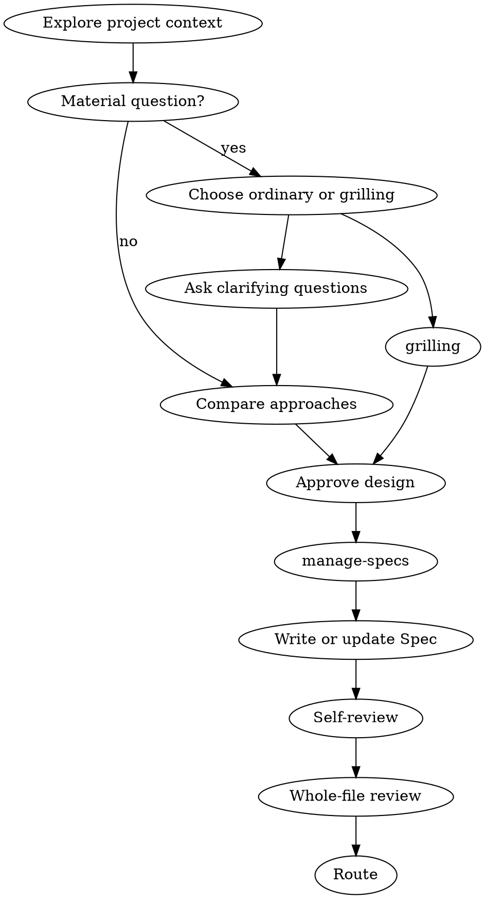

# Brainstorming

Turn a material design request into one reviewable Spec Bundle. Keep design, Spec identity, Plan, Tasks, implementation, and experiments in their separate owners.

## 1. Confirm that design work is needed

Enter for a new capability, a material external behavior/interface/module change, or material tradeoffs that project facts cannot resolve. Routine implementation, a small internal correction within an accepted contract, and existing-code experiments do not enter this Skill: continue the current Task flow or use `$record-experiment` for the experiment.

Once entered, do not implement source code, create a Plan or Tasks, or run an implementation skill before the Spec is accepted.

**Completion:** the request has either remained on its existing path or has a bounded material design question.

## 2. Establish design facts

1. Read only the relevant Architecture, accepted Bundle documents, code, tests, configuration, Records, and current Git facts.
2. If the request contains independently valuable capabilities with separate approval, implementation, validation, or rollback boundaries, explain the decomposition and design one bounded capability at a time.
3. Do not ask again for facts already established by project evidence or the user. When a material uncertainty remains about value, behavior, interface, data, lifecycle, risk, or acceptance, let the user choose a mode before asking: ordinary mode asks one question at a time and resolves only what is needed for a complete design; `$grilling` probes each related decision.

**Completion:** the problem, constraints, observable success criteria, and the bounded design surface are explicit.

## 3. Compare and approve the design decision

Ordinary mode presents 2–3 approaches with tradeoffs and a recommendation. When the user chooses `$grilling`, invoke `$grilling` to resolve the remaining material uncertainties one by one; return to this Skill after shared understanding is reached.

Synthesize a complete proposed design that covers the affected modules, interfaces, data flow, error behavior, test/experiment evidence, migration implications, and deliberate non-goals. Keep unrelated refactoring outside the design.

Obtain user approval before any Spec write. Shared understanding does not approve the design; approval of the design does not classify a Spec, accept a Spec, approve a Plan, approve Tasks, or authorize implementation.

**Completion:** the user-approved design content is specific enough to fill a complete Spec without inventing material decisions.



## 4. Establish the Spec Bundle

Invoke `$manage-specs` with the design context before writing. It returns exactly one classification:

- `Update Existing Spec`
- `Create Independent Spec`
- `Create Successor Spec`
- `Need Human Classification`

Use its classification, confirmation gate, selected Bundle path, and current identity. This owner transition is a hard stop: if `$manage-specs` is unavailable, cannot be read, or does not return a complete classification and canonical path, do not classify or write the Spec yourself. Do not duplicate its ID allocation, revision, successor, slug, or Index logic. If it returns `Need Human Classification`, stop for that decision. If its selected classification requires confirmation, get confirmation of the complete path before writing; an ID- or Topic-only reply is not path approval.

Read the selected template from `skills/manage-specs/assets/`: use `spec-template.zh_CN.md` for a Chinese repository language preference; otherwise use `spec-template.md`. user-readable Spec prose follows the repository language preference; do not infer its language from the task prompt. Preserve code symbols, field names, paths, commands, and template-required headings as written.

Write or revise the selected Bundle file. For `Create Successor Spec`, also make only the linked old `spec.md` update required by `$manage-specs`:

```text
hello-scholar/specs/<topic-id>/SPEC-NNN-<design-name>/spec.md
```

Fill all seven core sections with the approved design:

1. Value and Current Decision
2. Problem and Current Facts
3. Goals and Non-goals
4. Target Design
5. Interfaces, Data, and Invariants
6. Implementation Boundaries
7. Acceptance and Validation

Add a conditional section only when a material risk requires it. The saved revision remains `status: draft` until whole-file review. Do not create an intermediate design document, hand-edit generated Indexes, or write Plan, Tasks, source code, or Record files.

Run:

```sh
hello-scholar docs check
hello-scholar docs sync
hello-scholar docs check
```

**Completion:** the selected `spec.md` transaction—plus only the linked old `spec.md` for a successor—and CLI-generated Indexes reflect the approved design decision.

## 5. Self-review and whole-file review

Review the saved Spec for all seven core sections, any necessary conditional section, placeholders, contradictions, ambiguity, scope, acceptance evidence, language, and agreement with the `manage-specs` classification, ID, revision, and Bundle path. Correct only the selected draft and rerun the same validation sequence.

Present the complete file for one whole-file user review. On explicit acceptance of that exact revision, set `status: accepted`, validate through the same CLI sequence, and stop if the user requests design-only work. Classification confirmation is not Spec acceptance.

**Completion:** the result is either an explicit review stop, a corrected draft awaiting review, or an accepted current Spec.

## 6. Route after acceptance

Only after the Spec is accepted, choose one terminal route:

- Existing-code experiment only: invoke `$record-experiment`; do not create a Plan.
- Implementation is requested: invoke `$writing-plans`; do not create `plan.md`, `tasks.md`, or source code here.
- Design-only: end after reporting the accepted Spec path and revision.

**Completion:** the next owner is named without starting its work, or the design-only branch ends.
