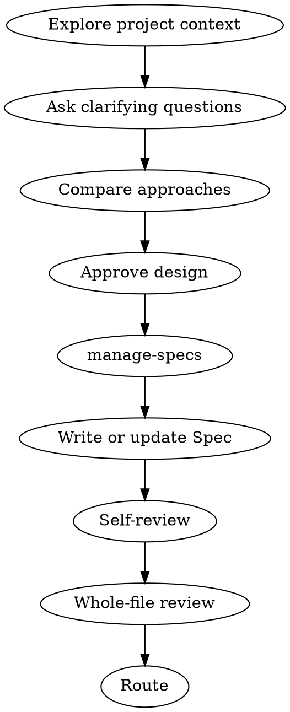

# 头脑风暴

将材料性设计请求转化为一份可审核的 Spec Bundle。设计、Spec 身份、Plan、Tasks、实施和实验分别由各自 owner 负责。

## 1. 确认需要设计工作

仅在新能力、材料性的外部行为、接口或模块变化，或项目事实无法解决的材料性权衡时进入。常规实施、已接受合同范围内的小型内部修正和已有代码实验不进入本 Skill：留在当前 Task 流程，或对实验使用 `$record-experiment`。

一旦进入，Spec accepted 前不实施源码、不创建 Plan 或 Tasks，也不运行实施 Skill。

**完成条件：** 请求要么留在原流程，要么已有边界清晰的材料性设计问题。

## 2. 建立设计事实

1. 只读取相关 Architecture、已接受的 Bundle 文档、代码、测试、配置、Record 和当前 Git 事实。
2. 若请求包含可独立批准、实施、验证或回滚的能力，说明拆分边界，并一次只设计一个有边界的能力。
3. 只为价值、行为、接口、数据、生命周期、风险或验收中的材料性不确定性一次一个问题。项目证据或用户已经确定的事实不重复询问。

**完成条件：** 问题、约束、可观察成功标准和设计范围都已明确。

## 3. 比较并批准设计决定

提出 2–3 种可行方案，说明权衡并给出建议。覆盖受影响模块、接口、数据流、错误行为、测试/实验依据、迁移影响和刻意不做的范围。无关重构不纳入设计。

展示完整的拟议决定，并在写入任何 Spec 前取得用户批准。设计决定获批不等于完成 Spec 分类、不等于 Spec accepted、不等于 Plan 或 Tasks 获批，也不授权实施。

**完成条件：** 用户已批准的设计内容足以填入完整 Spec，无需凭空补充材料性决定。



## 4. 建立 Spec Bundle

写入前用设计上下文调用 `$manage-specs`。它只能返回一种分类：

- `Update Existing Spec`
- `Create Independent Spec`
- `Create Successor Spec`
- `Need Human Classification`

使用它返回的分类、确认门、Bundle 路径和当前身份。这个 owner 转交是硬停止点：若 `$manage-specs` 不可用、无法读取，或没有返回完整分类和 canonical 路径，不能自行分类或写入 Spec。不要复制其 ID 分配、Revision、继任关系、slug 或 Index 逻辑。若返回 `Need Human Classification`，停在该决定；若选定分类需要确认，写入前先取得完整路径确认，只批准 ID 或 Topic 不属于路径批准。

读取 `skills/manage-specs/assets/` 中选定的模板：仓库语言偏好为中文时用 `spec-template.zh_CN.md`，否则用 `spec-template.md`。用户可读的 Spec 正文遵循仓库语言偏好；不要根据任务提示语言推断。代码符号、字段名、路径、命令和模板要求的标题保持原样。

写入或修订选定的 Bundle 文件。若为 `Create Successor Spec`，还只进行 `$manage-specs` 要求的关联旧 `spec.md` 更新：

```text
hello-scholar/specs/<topic-id>/SPEC-NNN-<design-name>/spec.md
```

把获批设计填入固定七个核心章节：

1. 价值与当前决定
2. 问题与当前事实
3. 目标与非目标
4. 目标设计
5. 接口、数据与不变量
6. 实施边界
7. 验收与验证

只有材料性风险确实需要时才增加条件章节。保存的 revision 在整份文件审核前保持 `status: draft`。不创建中间 design 文档，不手工编辑生成的 Index，也不写 Plan、Tasks、源码或 Record。

运行：

```sh
hello-scholar docs check
hello-scholar docs sync
hello-scholar docs check
```

**完成条件：** 选定的 `spec.md` 事务，以及仅在 successor 时关联的旧 `spec.md`，和 CLI 生成的 Index 都反映已批准的设计决定。

## 5. 自审与整份文件审核

检查保存的 Spec 是否含全部七个核心章节、必要条件章节、占位符、矛盾、歧义、范围、验收依据、语言，以及与 `manage-specs` 分类、ID、revision 和 Bundle 路径是否一致。只修正选定 draft，然后重跑相同验证序列。

将完整文件交给用户进行一次整份文件审核。用户明确接受该精确 revision 后，设为 `status: accepted`，通过相同 CLI 序列验证；若用户只要求完成设计则停止。分类确认不等于 Spec accepted。

**完成条件：** 结果是明确的审核停止点、等待审核的已修正 draft，或 accepted 的 Current Spec。

## 6. Accepted 后路由

只有在 Spec accepted 后，选择一个终止分支：

- 只运行已有代码实验：调用 `$record-experiment`，不创建 Plan。
- 用户要求实施：调用 `$writing-plans`，本 Skill 不创建 `plan.md`、`tasks.md` 或源码。
- 只完成设计：报告 accepted Spec 路径和 revision 后结束。

**完成条件：** 只点名下一 owner 而不启动其工作，或结束 design-only 分支。
