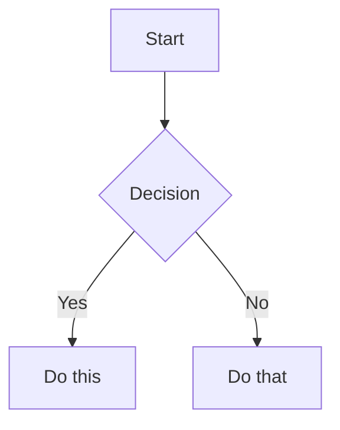

# Obsidian Flavored Markdown Skill

创建并编辑合法的 Obsidian Flavored Markdown。Obsidian 在 CommonMark 和 GFM 基础上扩展了 wikilink、embed、callout、properties、comment 以及其他语法。本 skill 只覆盖 Obsidian 特有扩展，标准 Markdown（标题、加粗、斜体、列表、引用、代码块、表格）默认视为已知内容。

## Workflow: Creating an Obsidian Note

1. 在文件顶部**添加 frontmatter** 属性（title、tags、aliases）。所有属性类型见 [PROPERTIES.md](references/PROPERTIES.md)。
2. 使用标准 Markdown 编写主体结构，并结合下方的 Obsidian 专属语法。
3. 用 wikilink（`[[Note]]`）连接 vault 内部笔记；外部链接使用标准 Markdown link。
4. 使用 `![[embed]]` 语法嵌入其他笔记、图片或 PDF。所有嵌入类型见 [EMBEDS.md](references/EMBEDS.md)。
5. 使用 `> [!type]` 语法添加高亮信息的 callout。所有 callout 类型见 [CALLOUTS.md](references/CALLOUTS.md)。
6. 在 Obsidian 的 reading view 中确认笔记渲染正确。

> 在 wikilink 和 Markdown link 之间做选择时：vault 内笔记使用 `[[wikilinks]]`，因为 Obsidian 会自动跟踪重命名；外部 URL 才使用 `[text](url)`。

## Internal Links (Wikilinks)

```markdown
[[Note Name]]                          链接到笔记
[[Note Name|Display Text]]             自定义显示文本
[[Note Name#Heading]]                  链接到标题
[[Note Name#^block-id]]                链接到块
[[#Heading in same note]]              同一笔记内的标题链接
```

给任意段落追加 `^block-id` 即可定义 block ID：

```markdown
This paragraph can be linked to. ^my-block-id
```

对于列表和引用块，把 block ID 放在块后面的单独一行：

```markdown
> A quote block

^quote-id
```

## Embeds

在任意 wikilink 前加 `!` 即可内联嵌入内容：

```markdown
![[Note Name]]                         嵌入整篇笔记
![[Note Name#Heading]]                 嵌入某个章节
![[image.png]]                         嵌入图片
![[image.png|300]]                     嵌入指定宽度图片
![[document.pdf#page=3]]               嵌入 PDF 第 3 页
```

音频、视频、搜索嵌入和外部图片见 [EMBEDS.md](references/EMBEDS.md)。

## Callouts

```markdown
> [!note]
> 基础 callout。

> [!warning] Custom Title
> 带自定义标题的 callout。

> [!faq]- 默认折叠
> 可折叠 callout（`-` 默认折叠，`+` 默认展开）。
```

常见类型：`note`、`tip`、`warning`、`info`、`example`、`quote`、`bug`、`danger`、`success`、`failure`、`question`、`abstract`、`todo`。

完整列表及 alias、嵌套、自定义 CSS callout 见 [CALLOUTS.md](references/CALLOUTS.md)。

## Properties (Frontmatter)

```yaml
---
title: My Note
date: 2024-01-15
tags:
  - project
  - active
aliases:
  - Alternative Name
cssclasses:
  - custom-class
---
```

默认属性：
- `tags`：可搜索标签
- `aliases`：用于链接建议的别名
- `cssclasses`：用于样式的 CSS class

所有属性类型、tag 语法规则和进阶用法见 [PROPERTIES.md](references/PROPERTIES.md)。

## Tags

```markdown
#tag                    行内标签
#nested/tag             带层级的嵌套标签
```

Tag 可以包含字母、数字（但不能作为首字符）、下划线、连字符和正斜杠。Tag 也可以通过 frontmatter 的 `tags` 属性定义。

## Comments

```markdown
This is visible %%but this is hidden%% text.

%%
This entire block is hidden in reading view.
%%
```

## Obsidian-Specific Formatting

```markdown
==Highlighted text==                   高亮语法
```

## Math (LaTeX)

```markdown
Inline: $e^{i\pi} + 1 = 0$

Block:
$$
\frac{a}{b} = c
$$
```

## Diagrams (Mermaid)

````markdown

````

如果要把 Mermaid 节点链接到 Obsidian 笔记，可添加 `class NodeName internal-link;`。

## Footnotes

```markdown
Text with a footnote[^1].

[^1]: Footnote content.

Inline footnote.^[This is inline.]
```

## Complete Example

````markdown
---
title: Project Alpha
date: 2024-01-15
tags:
  - project
  - active
status: in-progress
---

# Project Alpha

This project aims to [[improve workflow]] using modern techniques.

> [!important] Key Deadline
> The first milestone is due on ==January 30th==.

## Tasks

- [x] Initial planning
- [ ] Development phase
  - [ ] Backend implementation
  - [ ] Frontend design

## Notes

The algorithm uses $O(n \log n)$ sorting. See [[Algorithm Notes#Sorting]] for details.

![[Architecture Diagram.png|600]]

Reviewed in [[Meeting Notes 2024-01-10#Decisions]].
````

## References

- [Obsidian Flavored Markdown](https://help.obsidian.md/obsidian-flavored-markdown)
- [Internal links](https://help.obsidian.md/links)
- [Embed files](https://help.obsidian.md/embeds)
- [Callouts](https://help.obsidian.md/callouts)
- [Properties](https://help.obsidian.md/properties)
