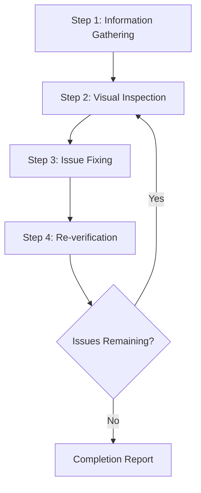
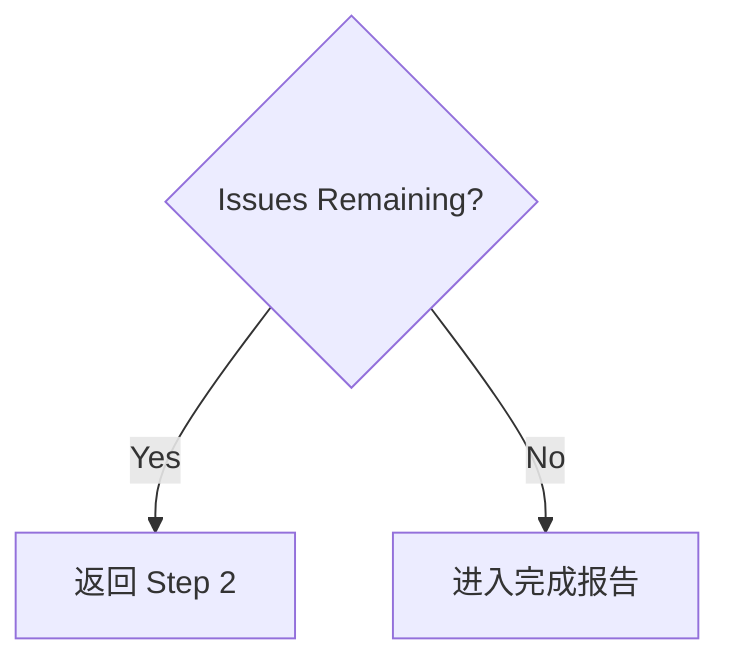

# Web Design Reviewer

本 skill 用于对网站设计质量进行可视化检查和验证，并在源码层定位与修复问题。

## Scope of Application

- 静态站点（HTML / CSS / JS）
- React / Vue / Angular / Svelte 等 SPA
- Next.js / Nuxt / SvelteKit 等全栈框架
- WordPress / Drupal 等 CMS
- 其他任意 web application

## Prerequisites

### Required

1. **目标网站必须已运行**
   - 本地开发服务（如 `http://localhost:3000`）
   - Staging 环境
   - Production 环境（只读审查场景）

2. **浏览器自动化能力必须可用**
   - 截图
   - 页面导航
   - DOM 信息获取

3. **具备源码访问权限（需要修复时）**
   - 项目必须位于当前 workspace 中

## Workflow Overview



---

## Step 1: Information Gathering Phase

### 1.1 URL Confirmation

如果用户没有提供 URL，先询问：

> 请提供要审查的网站 URL（例如 `http://localhost:3000`）

### 1.2 Understanding Project Structure

需要修复时，先收集以下信息：

| Item | Example Question |
|------|------------------|
| Framework | 使用的是 React / Vue / Next.js 等哪个框架？ |
| Styling Method | CSS / SCSS / Tailwind / CSS-in-JS 等哪种样式方案？ |
| Source Location | 样式文件和组件位于哪里？ |
| Review Scope | 只看特定页面，还是覆盖整站？ |

### 1.3 Automatic Project Detection

尝试从 workspace 中文件自动识别项目：

```text
Detection targets:
├── package.json     → 框架与依赖
├── tsconfig.json    → 是否使用 TypeScript
├── tailwind.config  → Tailwind CSS
├── next.config      → Next.js
├── vite.config      → Vite
├── nuxt.config      → Nuxt
└── src/ or app/     → 源码目录
```

### 1.4 Identifying Styling Method

| Method | Detection | Edit Target |
|--------|-----------|-------------|
| Pure CSS | `*.css` 文件 | 全局 CSS 或组件 CSS |
| SCSS/Sass | `*.scss`, `*.sass` | SCSS 文件 |
| CSS Modules | `*.module.css` | module CSS 文件 |
| Tailwind CSS | `tailwind.config.*` | 组件中的 `className` |
| styled-components | 代码中出现 `styled.` | JS / TS 文件 |
| Emotion | `@emotion/` import | JS / TS 文件 |
| CSS-in-JS (other) | inline styles | JS / TS 文件 |

---

## Step 2: Visual Inspection Phase

### 2.1 Page Traversal

1. 访问指定 URL
2. 截图
3. 获取 DOM 结构 / snapshot（若可用）
4. 如果存在其他页面，通过导航继续遍历

### 2.2 Inspection Items

#### Layout Issues

| Issue | Description | Severity |
|-------|-------------|----------|
| Element Overflow | 内容从父元素或 viewport 溢出 | High |
| Element Overlap | 元素发生非预期重叠 | High |
| Alignment Issues | Grid 或 flex 对齐问题 | Medium |
| Inconsistent Spacing | padding / margin 不一致 | Medium |
| Text Clipping | 长文本处理不当被裁切 | Medium |

#### Responsive Issues

| Issue | Description | Severity |
|-------|-------------|----------|
| Non-mobile Friendly | 小屏下布局崩坏 | High |
| Breakpoint Issues | 屏幕变化时过渡不自然 | Medium |
| Touch Targets | 移动端按钮过小 | Medium |

#### Accessibility Issues

| Issue | Description | Severity |
|-------|-------------|----------|
| Insufficient Contrast | 文字与背景对比度不足 | High |
| No Focus State | 键盘导航时看不出 focus 状态 | High |
| Missing alt Text | 图片缺少替代文本 | Medium |

#### Visual Consistency

| Issue | Description | Severity |
|-------|-------------|----------|
| Font Inconsistency | 字体族混用 | Medium |
| Color Inconsistency | 品牌色不统一 | Medium |
| Spacing Inconsistency | 相似元素间距不统一 | Low |

#### Product Fit

| Issue | Description | Severity |
|-------|-------------|----------|
| Design Contract Drift | 当前 plan / PRD UI 决策或项目设计文档未被实现 | High |
| Generic Aesthetic | 页面缺少明确视觉方向，呈现模板化或通用 AI 审美 | Medium |
| State Mismatch | loading、empty、error、success 等状态与主界面语言不一致 | Medium |

### 2.3 Viewport Testing (Responsive)

按以下 viewport 测试：

| Name | Width | Representative Device |
|------|-------|----------------------|
| Mobile | 375px | iPhone SE / 12 mini |
| Tablet | 768px | iPad |
| Desktop | 1280px | 标准 PC |
| Wide | 1920px | 大屏显示器 |

---

## Step 3: Issue Fixing Phase

### 3.1 Issue Prioritization


### 3.2 Identifying Source Files

从有问题的元素反查源码文件：

1. **基于 selector 搜索**
   - 通过 class name 或 ID 搜代码
   - 用 `grep_search` 查找样式定义

2. **基于 component 搜索**
   - 从元素文本或结构判断组件来源
   - 用 `semantic_search` 查看相关文件

3. **按文件模式过滤**
   ```text
   Style files: src/**/*.css, styles/**/*
   Components: src/components/**/*
   Pages: src/pages/**, app/**
   ```

### 3.3 Applying Fixes

具体框架修复策略见 [references/framework-fixes.md](references/framework-fixes.md)。

#### 修复原则

1. **最小变更**：只做解决问题所需的最小修改
2. **尊重现有模式**：遵循项目当前代码风格
3. **避免破坏性影响**：谨慎评估对其他区域的影响
4. **必要时加注释**：对复杂修复补充简短原因说明

---

## Step 4: Re-verification Phase

### 4.1 Post-fix Confirmation

1. 重新加载浏览器（或等待开发服务器 HMR）
2. 对修复区域重新截图
3. 对比前后效果

### 4.2 Regression Testing

- 确认修复没有影响其他区域
- 确认 responsive 展示未被破坏

### 4.3 Iteration Decision



**迭代上限**：同一问题如果连续修 3 次仍未解决，应与用户确认再继续。

---

## Output Format

### Review Results Report

```markdown
# Web Design Review Results

## Summary

| Item | Value |
|------|-------|
| Target URL | {URL} |
| Framework | {Detected framework} |
| Styling | {CSS / Tailwind / etc.} |
| Tested Viewports | Desktop, Mobile |
| Issues Detected | {N} |
| Issues Fixed | {M} |

## Detected Issues

### [P1] {Issue Title}

- **Page**: {Page path}
- **Element**: {Selector or description}
- **Issue**: {Detailed description of the issue}
- **Fixed File**: `{File path}`
- **Fix Details**: {Description of changes}
- **Screenshot**: Before/After

### [P2] {Issue Title}
...

## Unfixed Issues (if any)

### {Issue Title}
- **Reason**: {Why it was not fixed/could not be fixed}
- **Recommended Action**: {Recommendations for user}

## Recommendations

- {Suggestions for future improvements}
```

---

## Required Capabilities

| Capability | Description | Required |
|------------|-------------|----------|
| Web Page Navigation | 访问 URL、页面跳转 | ✅ |
| Screenshot Capture | 页面截图 | ✅ |
| Image Analysis | 识别视觉问题 | ✅ |
| DOM Retrieval | 获取页面结构 | 推荐 |
| File Read/Write | 读取与编辑源码 | 修复时必需 |
| Code Search | 项目内代码搜索 | 修复时必需 |

---

## Reference Implementation

### Implementation with Playwright MCP

[Playwright MCP](https://github.com/microsoft/playwright-mcp) 是本 skill 的推荐参考实现。

| Capability | Playwright MCP Tool | Purpose |
|------------|---------------------|---------|
| Navigation | `browser_navigate` | 访问 URL |
| Snapshot | `browser_snapshot` | 获取 DOM 结构 |
| Screenshot | `browser_take_screenshot` | 用于视觉检查 |
| Click | `browser_click` | 交互元素点击 |
| Resize | `browser_resize` | 做 responsive 测试 |
| Console | `browser_console_messages` | 检测 JS error |

#### Configuration Example (MCP Server)

```json
{
  "mcpServers": {
    "playwright": {
      "command": "npx",
      "args": ["-y", "@playwright/mcp@latest", "--caps=vision"]
    }
  }
}
```

### Other Compatible Browser Automation Tools

| Tool | Features |
|------|----------|
| Selenium | 浏览器支持广，多语言生态成熟 |
| Puppeteer | 聚焦 Chrome / Chromium，适合 Node.js |
| Cypress | 易于和 E2E testing 集成 |
| WebDriver BiDi | 标准化的新一代协议 |

只要工具具备导航、截图、DOM 获取等必要能力，都可以按相同流程实现。

---

## 最佳实践

### DO

- ✅ 修复前始终保留截图
- ✅ 一次只修一个问题，并逐个验证
- ✅ 遵循项目现有代码风格
- ✅ 涉及较大变更前先与用户确认
- ✅ 充分记录修复细节

### DON'T

- ❌ 未确认就做大规模重构
- ❌ 无视设计系统或品牌规范
- ❌ 为修 UI 忽视性能
- ❌ 同时修多个问题，导致难以验证

---

## Troubleshooting

### Problem: 找不到样式文件

1. 检查 `package.json` 中的依赖
2. 考虑是否使用 CSS-in-JS
3. 考虑样式是否在构建期生成
4. 询问用户具体的样式方案

### Problem: 修复后页面没变化

1. 检查开发服务器 HMR 是否正常
2. 清空浏览器缓存
3. 如果项目需要，重新构建
4. 检查 CSS specificity 问题

### Problem: 修复影响了其他区域

1. 回退本次修改
2. 使用更具体的 selector
3. 评估是否应改用 CSS Modules 或 scoped styles
4. 与用户确认允许影响范围
