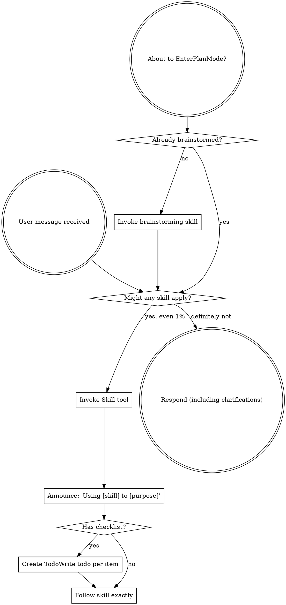

<SUBAGENT-STOP>
If you were dispatched as a subagent to execute a specific task, skip this skill.
</SUBAGENT-STOP>

<EXTREMELY-IMPORTANT>
If you think there is even a 1% chance a skill might apply to what you are doing, you ABSOLUTELY MUST invoke the skill.

IF A SKILL APPLIES TO YOUR TASK, YOU DO NOT HAVE A CHOICE. YOU MUST USE IT.

This is not negotiable. This is not optional. You cannot rationalize your way out of this.
</EXTREMELY-IMPORTANT>

## Instruction Priority

Hello-scholar skills override default system prompt behavior, but **user instructions always take precedence**:

1. **User's explicit instructions** (CLAUDE.md, GEMINI.md, AGENTS.md, direct requests) — highest priority
2. **Hello-scholar skills** — override default system behavior where they conflict
3. **Default system prompt** — lowest priority

If CLAUDE.md, GEMINI.md, or AGENTS.md says "don't use TDD" and a skill says "always use TDD," follow the user's instructions. The user is in control.

## How to Access Skills

**In Claude Code:** Use the `Skill` tool. When you invoke a skill, its content is loaded and presented to you—follow it directly. Never use the Read tool on skill files.

**In Copilot CLI:** Use the `skill` tool. Skills are auto-discovered from installed plugins. The `skill` tool works the same as Claude Code's `Skill` tool.

**In Gemini CLI:** Skills activate via the `activate_skill` tool. Gemini loads skill metadata at session start and activates the full content on demand.

**In other environments:** Check your platform's documentation for how skills are loaded.

## Platform Adaptation

Skills use Claude Code tool names. Non-CC platforms: see `references/copilot-tools.md` (Copilot CLI), `references/codex-tools.md` (Codex) for tool equivalents. Gemini CLI users get the tool mapping loaded automatically via GEMINI.md.

# Using Hello-Scholar Skills

## Rule

**Invoke relevant or requested skills BEFORE any response or action.** Even a 1% chance a skill might apply means that you should invoke the skill to check. If an invoked skill turns out to be wrong for the situation, you don't need to use it.

## Experiment Routing

Small, local, or smoke experiments with no retained evidence run directly without `record-experiment`. Clearly formal, baseline, release, full training, GPU, remote, or retained evidence work invokes `record-experiment` before launch. A command name such as `eval`, `benchmark`, or `experiment` is not enough by itself. For ambiguous low-risk work, run directly and do not ask; ask only when production-data use, an irreversible operation, or significant cost is unclear.

## Task Continuation

Route progress, completion status, remaining work, or continuation requests to the current Task state, not `converge-to-spec`.

- **Resolve:** after same-session compaction, resume TodoWrite. In a new conversation, read `hello-scholar/specs/INDEX.md`; a named Bundle only selects the target. Otherwise use the lifecycle gate `accepted / Current / approved / pending|in-progress / incomplete`: one candidate resumes, many wait for a choice, and none stops. Do not guess by time or file order.
- **Verify:** read the target `tasks.md`; all INDEX gates must still hold and `approved_revision` must equal `revision`. Report and stop on failure. Otherwise report the Bundle, Tasks Revision, and frontier (the first unblocked unchecked Task). A switch changes only the current execution context; only explicit cancellation sets the old Bundle to `cancelled` and excludes it from recovery.
- **Execute:** after the current request explicitly authorizes implementation, continue the frontier by `Depends On` and track it in TodoWrite. Once all required Tasks have Validation and Completion evidence, update `tasks.md` once—checkboxes, `status: completed`, and `updated`—then run `hello-scholar docs sync` once.

## Architecture Reminder

When `architecture-missing` is first observed in an existing flow's `hello-scholar docs check` or `hello-scholar docs sync` output, report once in the current conversation that Architecture is missing but does not block the current work. Continue the current flow. Later occurrences need no reminder. Do not run another command or create a file for this reminder. If the user explicitly asks to create it, invoke `$docs-maintenance` in `architecture` mode.

## Red Flags

These thoughts mean STOP—you're rationalizing:

| Thought | Reality |
|---------|---------|
| "This is just a simple question" | Questions are tasks. Check for skills. |
| "I need more context first" | Skill check comes BEFORE clarifying questions. |
| "Let me explore the codebase first" | Skills tell you HOW to explore. Check first. |
| "I can check git/files quickly" | Files lack conversation context. Check for skills. |
| "Let me gather information first" | Skills tell you HOW to gather information. |
| "This doesn't need a formal skill" | If a skill exists, use it. |
| "I remember this skill" | Skills evolve. Read current version. |
| "This doesn't count as a task" | Action = task. Check for skills. |
| "The skill is overkill" | Simple things become complex. Use it. |
| "I'll just do this one thing first" | Check BEFORE doing anything. |
| "This feels productive" | Undisciplined action wastes time. Skills prevent this. |
| "I know what that means" | Knowing the concept ≠ using the skill. Invoke it. |

## Skill Priority

When multiple skills could apply, use this order:

1. **Process skills first** (brainstorming, debugging, takeoff, landing) - these determine HOW to approach the task
2. **Implementation skills second** (frontend-design, mcp-builder) - these guide execution

"Let's build X" → brainstorming first, then implementation skills.
"Fix this bug" → debugging first, then domain-specific skills.

## Skill Types

**Rigid** (TDD, debugging): Follow exactly. Don't adapt away discipline.

**Flexible** (patterns): Adapt principles to context.

The skill itself tells you which.

## User Instructions

Instructions say WHAT, not HOW. "Add X" or "Fix Y" doesn't mean skip workflows.
